# JMRI Easy UI

A lightweight web UI and REST API for [JMRI](https://www.jmri.org/) that makes it simple to browse and edit your roster, manage function labels, view/upload locomotive images, switch between layout connections and simple layout control like turnouts — all from a modern, single‑page web app.

> **Heads‑up:** This project is designed to run **inside JMRI**. The Java code is compiled as a JAR and dropped into JMRI’s `lib/` so its servlets and web assets are served by the built‑in JMRI Web Server.

---

## Contents

- [Features](#features)
- [Project Layout](#project-layout)
- [Prerequisites](#prerequisites)
- [Build & Install](#build--install)
  - [Build the Java server](#build-the-java-server)
  - [Build the website](#build-the-website)
  - [Install into JMRI](#install-into-jmri)
- [Using the App](#using-the-app)
  - [Roster](#roster)
  - [Turnouts](#turnouts)
  - [Connections](#connections)
- [Developer Workflow](#developer-workflow)
  - [Linting](#linting)
  - [Rebuilding quickly](#rebuilding-quickly)
- [Configuration Notes](#configuration-notes)
- [Troubleshooting](#troubleshooting)
- [Screenshots](#screenshots)
- [License](#license)

---

## Features

- 🚂 **Roster** — list, add, edit, delete, upload images, and manage function labels.
- 🔀 **Turnouts** — list, add, edit (system/user name), delete, and **toggle state (CLOSED/THROWN)**.
- 🔌 **Connections** — view all JMRI connections and pick the active one.
- 🖼️ **Zero‑setup UI** — ships as plain HTML/CSS/JS; no framework required at runtime.
- 🧰 **Single JAR** — custom servlet(s) bundled in one `jmri-easy-ui-server.jar` dropped into JMRI’s `lib/`.

---

## Project Structure

```
jmri-easy-ui/
├─ server/                     # Java servlets and build script
│  ├─ src/main/java/easy/      # Java sources (package: easy)
│  │  ├─ EasyWebConfig.java    # Web server config (maps /easy → web root)
│  │  ├─ RosterApiServlet.java # /api/roster/* endpoints
│  │  └─ ConnectionsApiServlet.java # /api/connections/* endpoints
│  ├─ src/main/resources/
│  │  └─ META-INF/services/
│  │     ├─ jmri.server.web.spi.WebServerConfiguration
│  │     └─ javax.servlet.http.HttpServlet
│  ├─ build.sh                 # Portable build script (macOS / Linux)
│  └─ dist/                    # Output jar created here
└─ web/                        # Web client app (Vite)
   ├─ index.html
   ├─ package.json
   ├─ eslint.config.mjs
   ├─ vite.config.mjs
   ├─ src/                     # JS/CSS/assets
   └─ dist/                    # Vite build output (gitignored)
```

**Package names:** Java files under `server/src/main/java/easy/` use `package easy;`.  
**Service loader:** `META-INF/services` is included so JMRI’s `ServiceLoader` can discover the config and servlets.

---

## Prerequisites

- **JMRI** installed
  - macOS default: `/Applications/JMRI`
  - Raspberry Pi default: `/home/pi/JMRI`
- **Java 11** (JMRI 5.x builds target Java 11)
- **Node.js 18+** (recommended LTS 20+) for the web app
- **Build tools**:
  - macOS: Xcode CLT or Homebrew coreutils (optional)
  - Linux/RPi: `bash`, `find`, `jar` (from JDK)

---

## Setup & Build (Java)

From `jmri-easy-ui/server`:

```bash
# 1) Point to your JMRI install directory
export JMRI_HOME="/Applications/JMRI"        # macOS
export JMRI_HOME="/home/pi/JMRI"           # Raspberry Pi

# 2) Build
./build.sh
```

The script compiles sources against JMRI’s jars and emits:

```
server/dist/jmri-easy-ui-server.jar
```

**Install the JAR** into JMRI:

```bash
# macOS
cp server/dist/jmri-easy-ui-server.jar "/Applications/JMRI/lib/"

# Raspberry Pi
cp server/dist/jmri-easy-ui-server.jar "/home/pi/JMRI/lib/"
```

Then **restart JMRI**.

> If you prefer manual compilation, the script mirrors:
> ```bash
> javac --release 11 \
>   -cp "$JMRI_HOME/*:$JMRI_HOME/lib/*" \
>   -d build/classes $(find src/main/java -type f -name '*.java')
> cp -r src/main/resources/* build/classes/
> jar cf "dist/jmri-easy-ui-server.jar" -C build/classes .
> ```

---

## Setup & Build (Web)

From `jmri-easy-ui/web`:

```bash
# 1) Install deps
npm ci

# 2) Lint
npm run lint

# 3) Dev server (optional)
npm run dev
# → http://localhost:5173 (vite dev server)

# 4) Build
npm run build
# → outputs to web/dist
```

You can either:
- Serve the **source** folder directly via JMRI (see config below), _or_
- Build with Vite and serve the **compiled** `web/dist` folder for best performance.

---

## Run

Start JMRI’s Web Server (Panels → Web Server). Once running:

- **Web app:**  
  Open `http://<jmri-host>:12080/easy/`  
  (This path is mapped by `EasyWebConfig` to your chosen web root.)

- **REST API examples:**
  ```bash
  # List roster entries
  curl http://<jmri-host>:12080/api/roster

  # Save functions for a locomotive by file
  curl -X POST http://<jmri-host>:12080/api/roster/fn/save \
    -d 'file=My_Loco.xml' \
    -d 'num[]=0' -d 'label[]=Headlight' -d 'lockable[]=on' \
    -d 'num[]=1' -d 'label[]=Bell'      -d 'lockable[]=off'

  # Set active connection by system prefix (e.g., D or I)
  curl -X POST http://<jmri-host>:12080/api/connections/select \
    -H 'Content-Type: application/json' \
    -d '{"systemPrefix":"D"}'
  ```

---

## Configuration (Web root)

`EasyWebConfig` resolves the web root in this order:

1. **System property** `-Deasy.web.root=/absolute/path`
2. **Env var** `EASY_WEB_ROOT=/absolute/path`
3. Default path based on OS:
   - macOS: `/Applications/JMRI/jmri-easy-ui/web`
   - Linux/RPi: `/home/pi/JMRI/jmri-easy-ui/web`

To use a **Vite build**, point `easy.web.root` at `web/dist`.

**Examples**

```bash
# macOS app bundle launcher (JMRI launcher args)
JAVA_OPTIONS="-Deasy.web.root=/Applications/JMRI/jmri-easy-ui/web/dist"

# Plain Java launch (advanced/manual)
java -Deasy.web.root="/home/pi/JMRI/jmri-easy-ui/web/dist" -jar JMRI.jar
```

> If JMRI logs “`<path>` is not allowed”, update `EasyWebConfig`’s allowed path list or ensure the path exists and is readable by the JMRI process.

---

## API

### `/api/roster`

- `GET /api/roster` – list roster entries
- `GET /api/roster/icon?id=<ID>|file=<XML>` – fetch image (or SVG placeholder)
- `POST /api/roster/add` – create entry (form fields) or upload XML (`multipart file`)
- `POST /api/roster/update` – update common fields (`id, address, road, number, owner, model`)
- `POST /api/roster/image` – upload/attach an image (`multipart image`)
- `POST /api/roster/delete` – delete by `id` or `file`

### Functions

- `GET /api/roster/fn/list?id|file` – read `<functionlabels>` as JSON
- `POST /api/roster/fn/save` – replace `<functionlabels>`  
  `num[]`, `label[]`, `lockable[]` arrays (x-www-form-urlencoded)

### Decoder

- `GET /api/roster/decoder?id|file` – read decoder + identify fields
- `POST /api/roster/decoder/save` – write decoder/identify fields  
  Required: `family`, `model`  
  Optional on `<locomotive ...>`: `mfgName`, `manufacturerID|mfgId`, `productID|productId`, `developerID|modelId`, `maxSpeed`, `dccAddress`  
  Also upserts:  
  ```xml
  <decoder model="" family="" comment="" />
  ```
  **above** `<locoaddress>` and refreshes `<dateUpdated>`.

### Connections

- `GET  /api/connections/list` – enumerate JMRI connections
- `POST /api/connections/select` – set active connection
  ```json
  { "systemPrefix": "D" }
  ```

---

## Troubleshooting

- **404 Not Found (HomeServlet)**  
  The server can’t see your jar. Verify the jar exists in `JMRI/lib/` and restart JMRI.

- **Web server won’t start: “path is not allowed”**  
  Ensure `easy.web.root` points to a **real** path and is included in `EasyWebConfig`’s allowed roots. Restart JMRI.

- **Roster XML not editable in DecoderPro**  
  Use the provided endpoints. The servlet ensures well‑formed XML, millisecond `<dateUpdated>`, and required sections.

- **macOS build fails with `mapfile: command not found`**  
  Use the included `build.sh` (portable), or run the manual `javac`/`jar` commands above.

---

## Developing with VS Code

- Install **Extension Pack for Java** (Red Hat, etc.).
- Add JMRI jars to your project’s referenced libraries or use the provided `build.sh` to compile against `"$JMRI_HOME/*:$JMRI_HOME/lib/*"`.
- For Java import resolution, set:
  ```jsonc
  // .vscode/settings.json
  {
    "java.configuration.runtimes": [
      { "name": "JavaSE-11", "path": "/Library/Java/JavaVirtualMachines/temurin-11.jdk/Contents/Home" }
    ]
  }
  ```
- Web: `npm ci`, `npm run dev`, `npm run build`, `npm run lint`.

---

## Screenshots

| Screen | Preview |
|---|---|
| Roster | 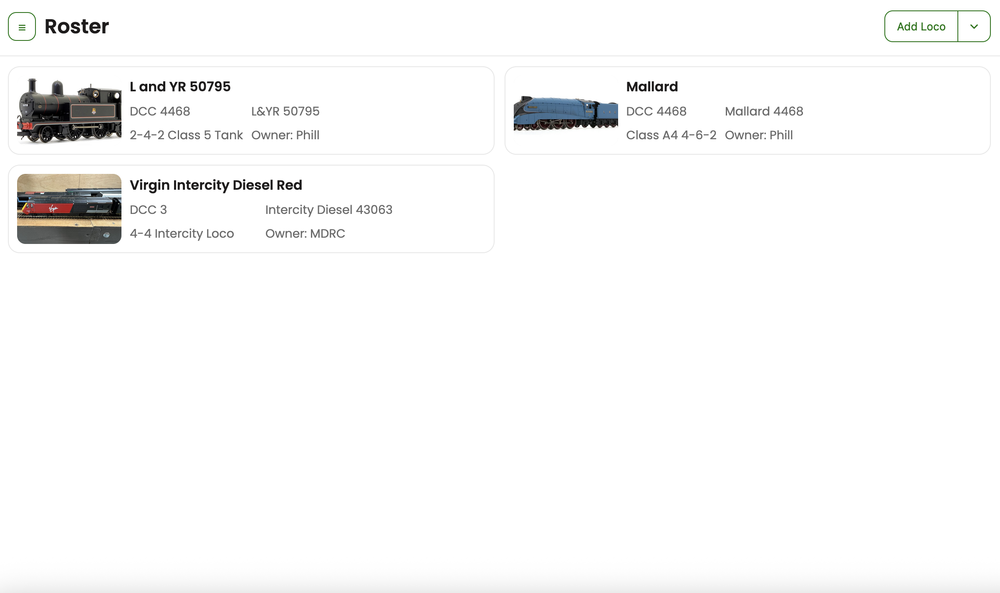 |
| Roster Add | 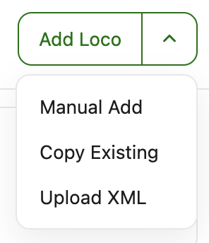 |
| Roster Add from Copy | 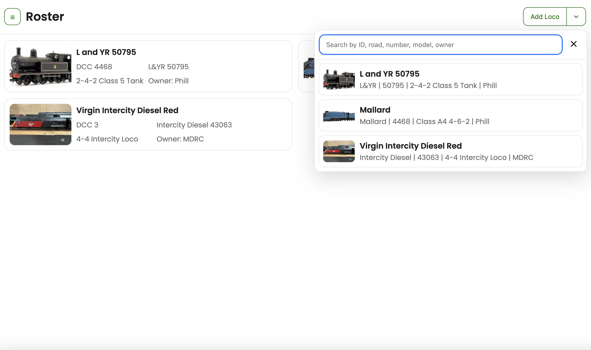 |
| Roster Edit 1/2 | 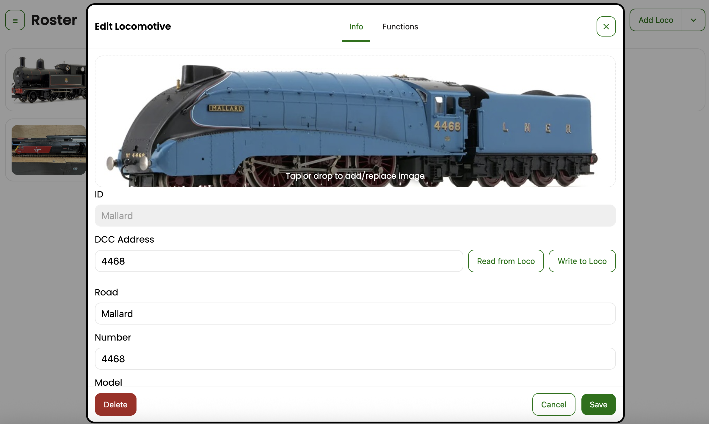 |
| Roster Edit 2/2 | 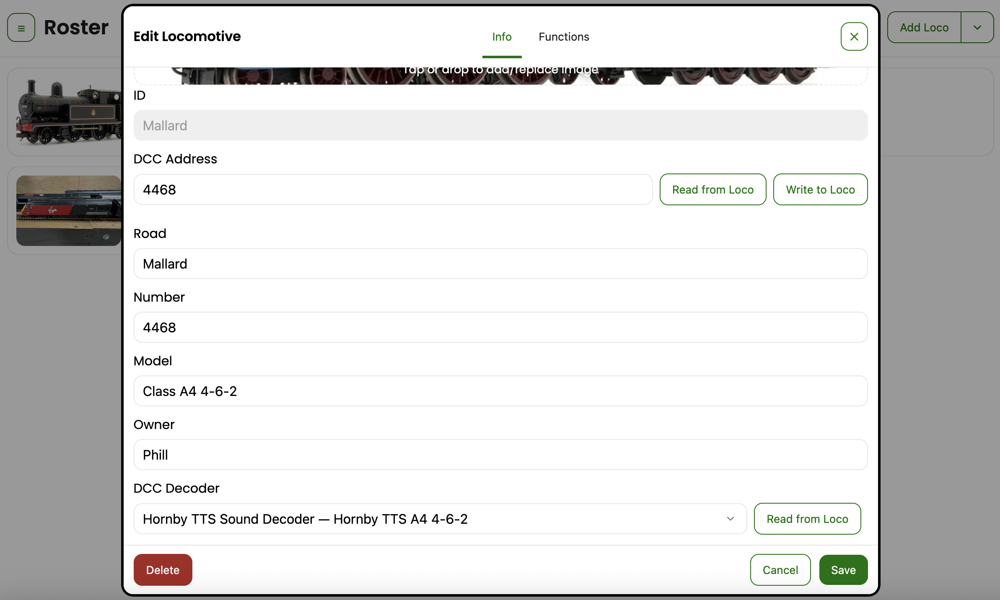 |
| Roster Functions Editor | 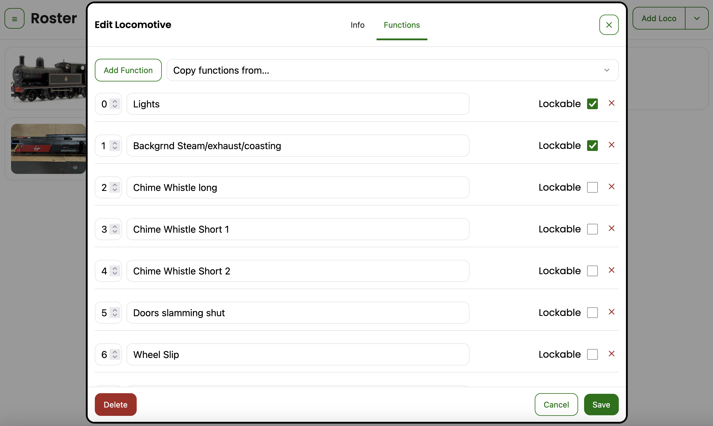 |
| Turnouts | 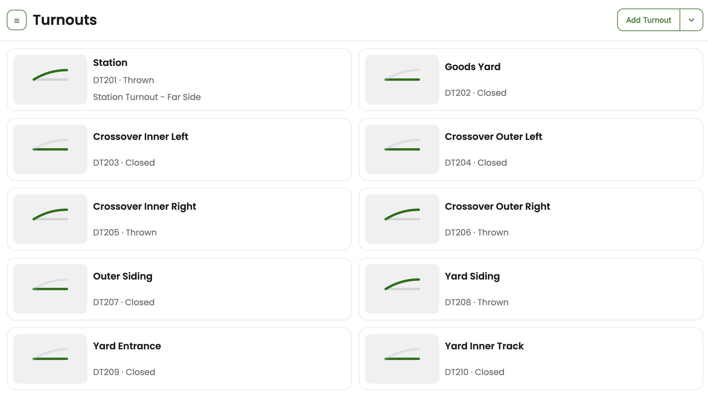 |
| Turnouts Add | 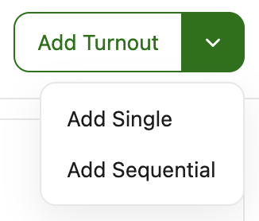 |
| Turnouts Add Multiple | 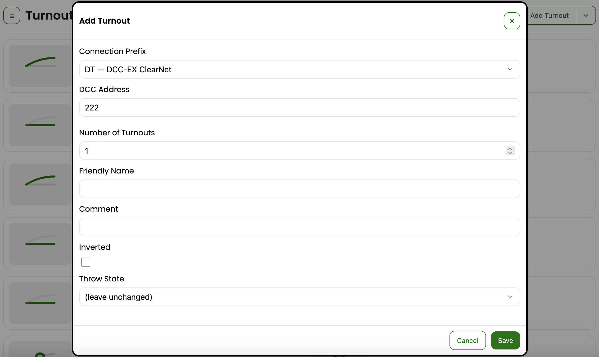 |
| Turnouts Edit | 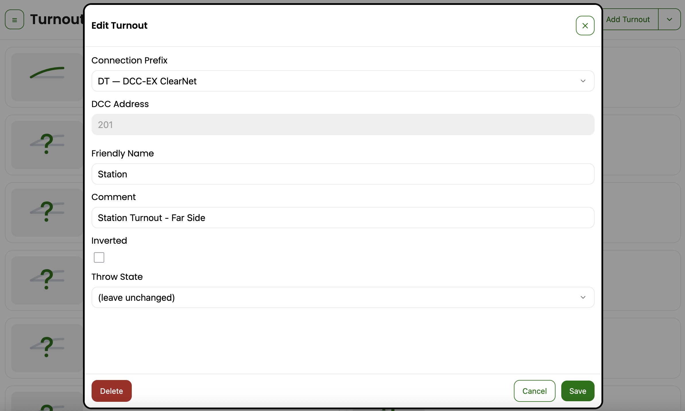 |
| Drawer Panel | 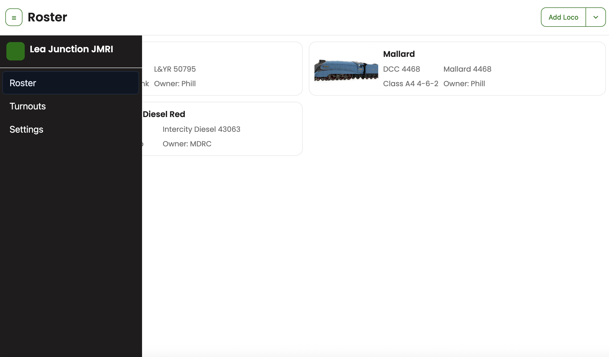 |
| Roster Mobile | 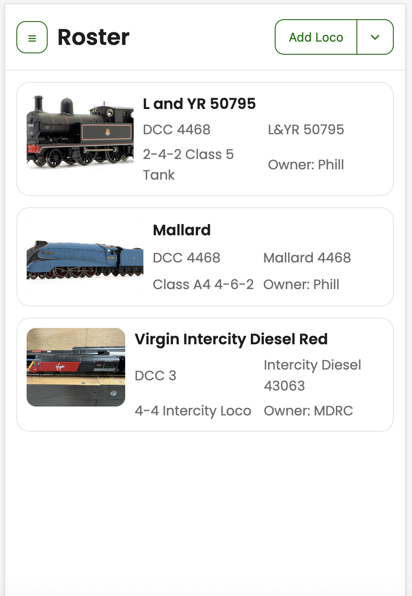 |
| Turnouts Mobile | 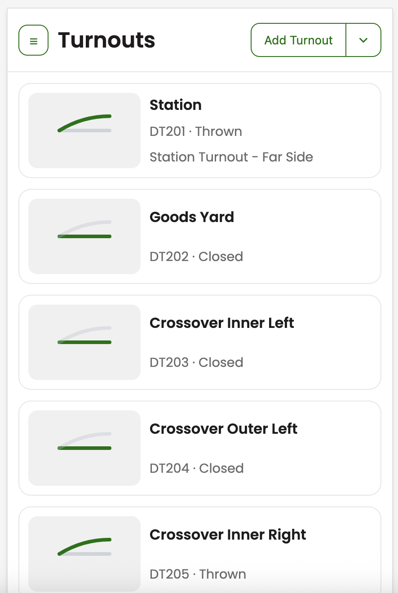 |
| Drawer Mobile | 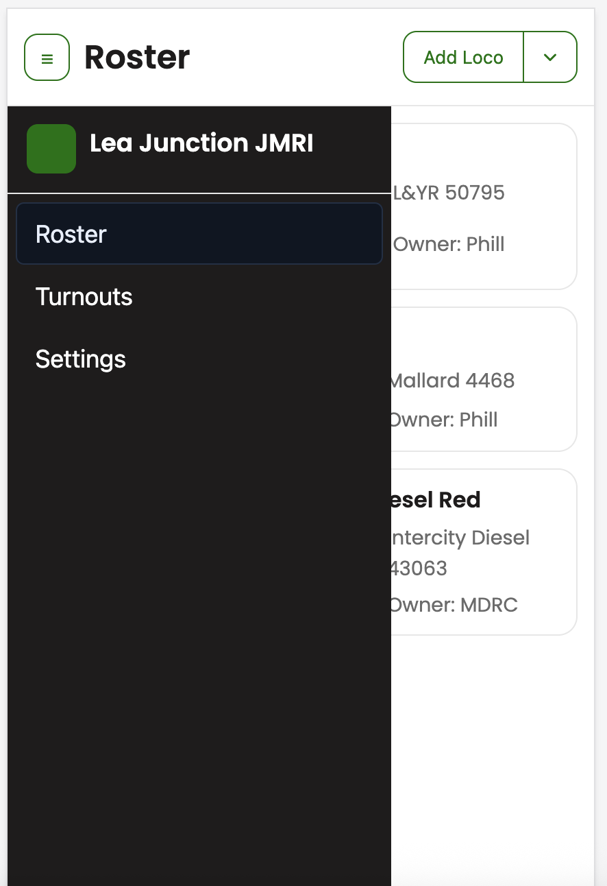 |

## License

MIT © You
